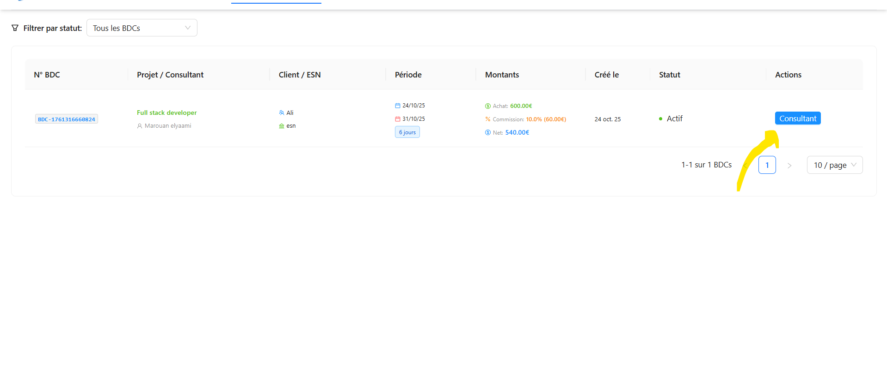
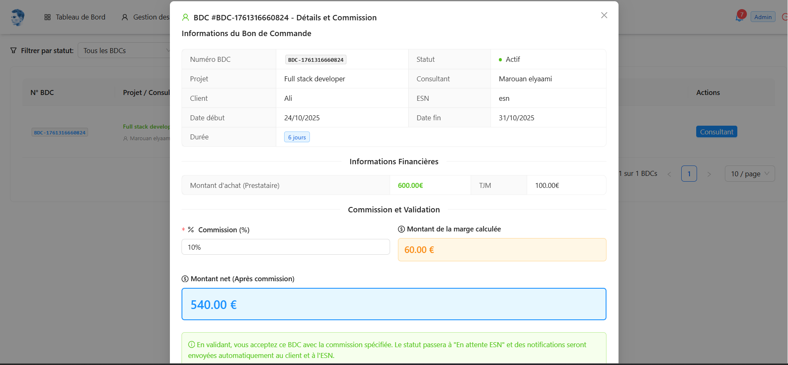
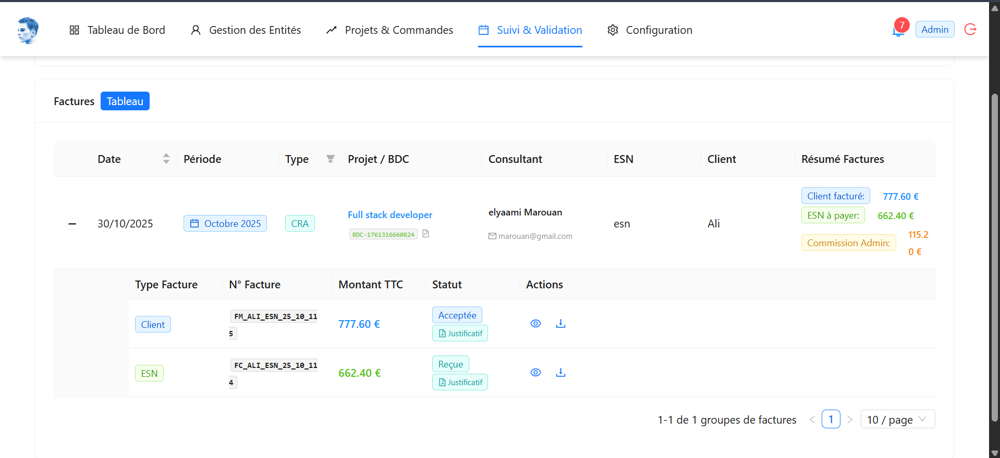

##  Rôle de l'Administrateur

L'administrateur a tous les droits sur la plateforme Maghreb Connect IT.

---

## Gestion des Utilisateurs (Client / ESN)

### Créer un utilisateur (Client / ESN)
1. Menu **Gestion des Entités** → **ESN/CLIENT**
2. Remplir les informations 
3. Cliquer sur **"Ajoute"**
#### Valider un profil (Valider un profil après le client ou l’ESN rem­pli toutes les infos)

1. Menu → **Gestion des Entités** → **ESN/CLIENT**
3. Vérifier les documents :
   - ✓ SIRET / Registre du commerce
   - ✓ Statuts de l'entreprise
   - ✓ Certificat d'immatriculation
   - ✓ Pièce d'identité du responsable
4. Actions possibles :
   - **"Approuver"** : Profil valide, compte activé
   - **"Re-envoyer un rappel"** : Demander documents complémentaires

### Désactiver les Profils ESN / Client

1. Menu **Gestion des Entités** → **ESN/CLIENT**
2. Cliquer sur **"Désactiver"**
3. Confirmer l'action

> ⚠️ Un utilisateur désactivé ne peut plus se connecter mais ses données restent dans le système.

## Supervision des Cycles
### Cycle AO
Menu → **Projets & Commandes** → **Appels d'offres**

- Voir tous les appels d'offres
- Tu peux activer ou désactiver une Appel d'offre.
### Cycle BDC
Menu → **Projets & Commandes** → **Bons de commande**

- Valider/annuler les bons de commande
- **Prendre la commission sur chaque BDC** :
  - Commission = Montant BDC × Pourcentage défini

### Cycle CRA
Menu → **Suivi & Validation** → **Validation CRA**

- Voir tous les CRA 

### Cycle Factures
1. Menu **Suivi & Validation** → **Gestion des Factures**

- **Accepter les paiements des clients** 
  - Voir les paiements en attente
  - Valider les paiements reçus
  - Reverser montant total à l'ESN (après commission)
---

