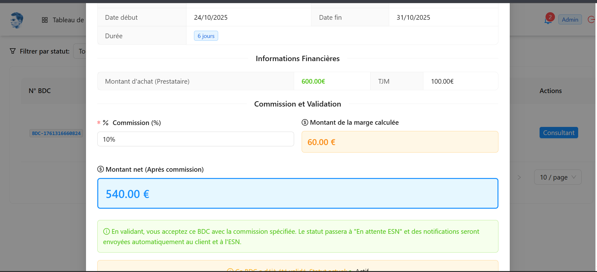

# 3. Guide Utilisation : Administrateur

##  Rôle de l'Administrateur

L'administrateur a tous les droits sur la plateforme Maghreb Connect IT.

---

## Gestion des Utilisateurs

### Créer un utilisateur
1. Menu **"Utilisateurs"** → **"Nouveau"**
2. Remplir les informations :
   - Nom et prénom
   - Email (servira d'identifiant)
   - Téléphone
   - Rôle : ESN / Client 
3. Cliquer sur **"Enregistrer"**

#### Valider un profil 
1. Menu → **"ESN "**
2. Cliquer sur l'ESN
3. Vérifier les documents :
   - ✓ SIRET / Registre du commerce
   - ✓ Statuts de l'entreprise
   - ✓ Certificat d'immatriculation
   - ✓ Pièce d'identité du responsable
4. Actions possibles :
   - **"Approuver"** : Profil valide, compte activé
   - **"Refuser"** : Demander documents complémentaires
5. L'ESN reçoit une notification

#### Valider un profil Client
1. Menu → **"Clients"**
2. Cliquer sur le client
3. Vérifier les documents :
   - ✓ SIRET / Registre du commerce
   - ✓ Statuts de l'entreprise
   - ✓ Certificat d'immatriculation
   - ✓ Pièce d'identité du responsable
4. Actions possibles :
   - **"Approuver"** : Profil valide, compte activé
   - **"Refuser"** : Demander documents complémentaires
5. Le client reçoit une notification

### Désactiver les Profils ESN / Client
1. Menu **"Utilisateurs"** → Sélectionner l'utilisateur
2. Cliquer sur **"Désactiver"**
3. Confirmer l'action

> ⚠️ Un utilisateur désactivé ne peut plus se connecter mais ses données restent dans le système.

## Supervision des Cycles

### Cycle AO
- Voir tous les appels d'offres

### Cycle BDC
- Valider/annuler des bons de commande
- **Prendre la commission sur chaque BDC** :
  - Commission = Montant BDC × Pourcentage défini
  - Automatiquement retenue lors de la facturation
### Cycle CRA

- Voir tous les CRA (tous consultants)

### Cycle Factures

- Accès à toutes les factures
- **Accepter les paiements des clients** 
  - Voir les paiements en attente
  - Valider les paiements reçus
  - Générer les reçus de paiement
  - Reverser l'argent à l'ESN (après commission)

---

