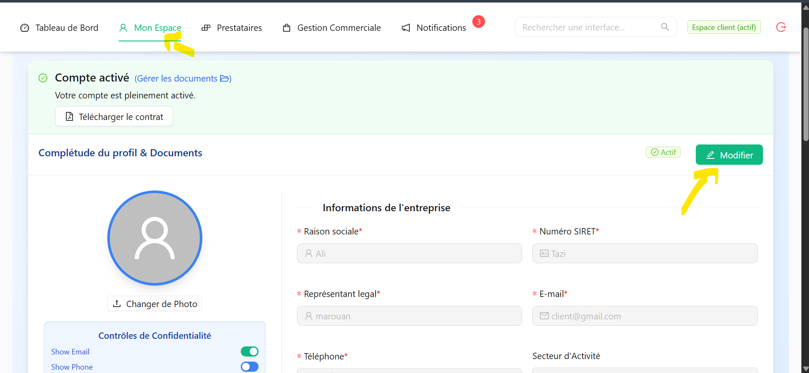
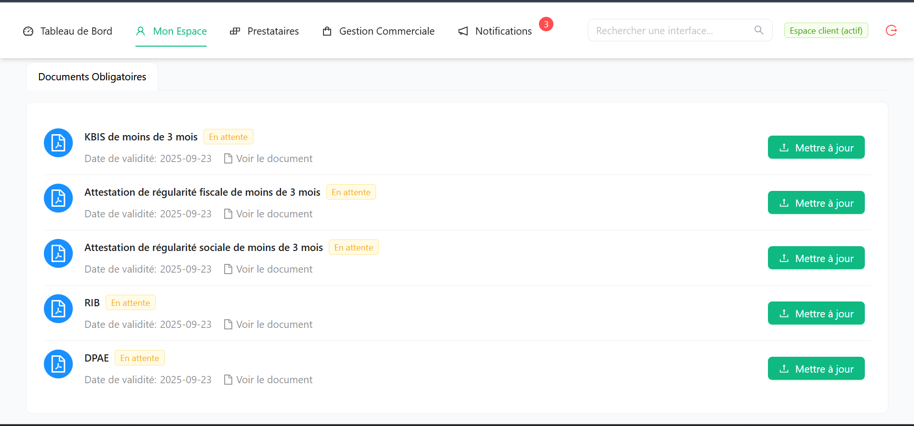
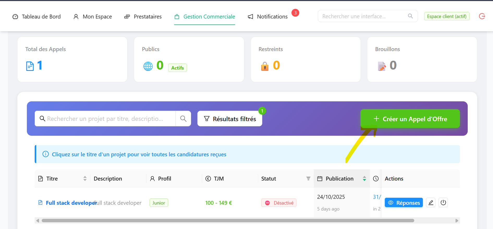
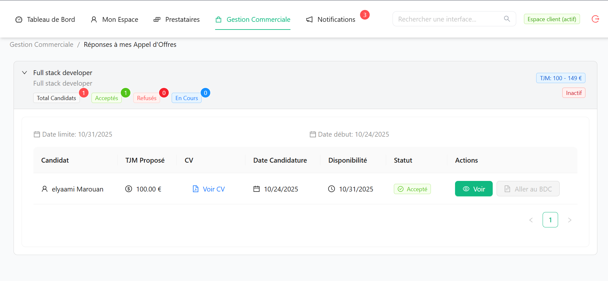
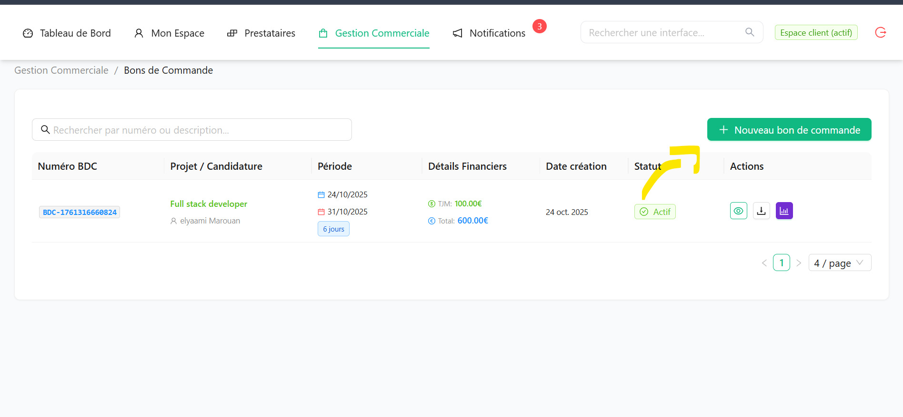
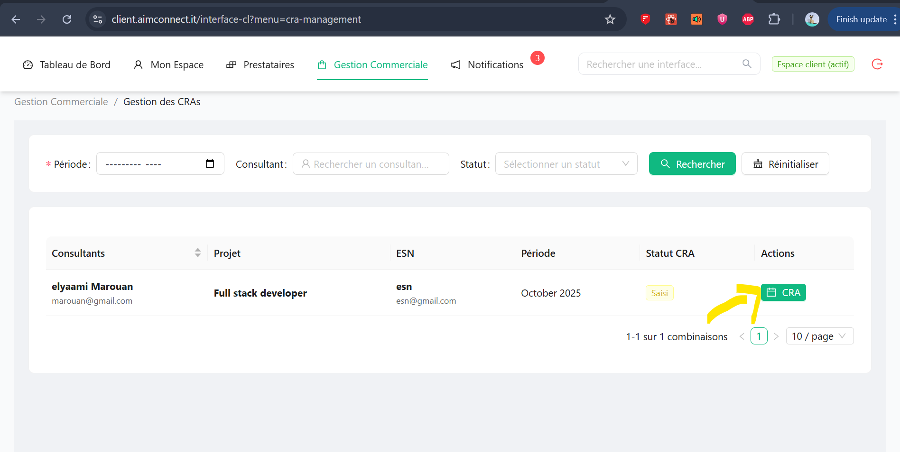
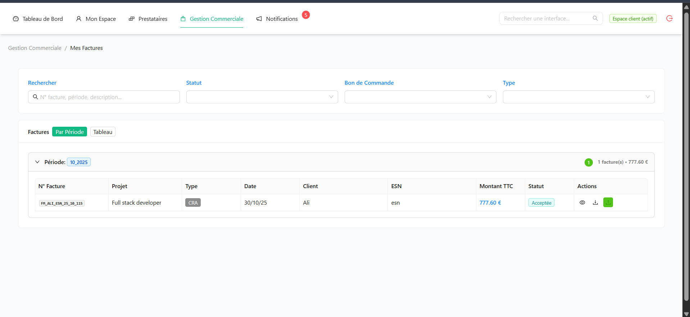
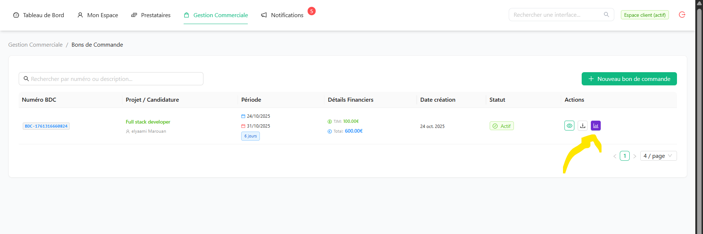
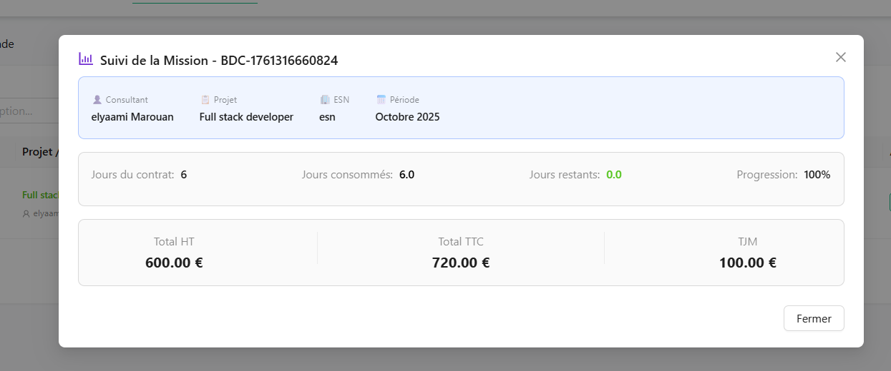

## Rôle du Client

En tant que client, vous pouvez publier des appels d'offres, valider les consultants, approuver les CRA et suivre vos factures.

---

## Activer Mon Compte Client
Menu **Mon Espace** → **Mon Profil Client**

### Après la création de votre compte

1. **Vérifier les informations** de votre entreprise (client)
2. **Vérifier et uploader les documents** 

3. **En attente d'acceptation par l'admin** 
   - L'administrateur vérifie vos informations
   - Délai : Généralement 1-2 jours ouvrés

4. **Signer le contrat d'utilisation** 
   - Lire les **conditions générales** (visible sur la page)
   - Cliquer sur **"Accepter et signer"**
   - Signature électronique automatique
   - Votre compte Client est activé !

### Vous pouvez maintenant :
- Créer des appels d'offres
- Consulter les candidatures
- Valider les CRA
- Gérer vos factures

## Créer un Appel d'Offres
Menu **Gestion Commerciale** → **Appels d'Offres**
### Nouveau AO

1. Remplir le formulaire 
2. Cliquer sur **"cree"**

L'AO est automatiquement envoyé aux ESN 

---

## Examiner les Candidatures
Menu **Gestion Commerciale** → Réponses à mes Appel d'Offres
### Consulter les propositions

1. Onglet **"Candidatures reçues"**

### Évaluer un candidat
1. Télécharger le **CV**
2. Comparer le **TJM** proposé
3. Actions possibles :
   - **"Accepter"** 
   - **"Refuser"** 

---

## Créer un Bon de Commande
Menu **Gestion Commerciale** → Bons de Commande
### Après sélection du consultant

1. Remplir les informations 
2. Cliquer sur **"Créer le BDC"**

### Le BDC est créé et envoyé ! 
- L'Admin reçoit le BDC pour validation 

---

## Valider les CRA (Comptes Rendus d'Activité)
Menu **Gestion Commerciale** → Gestion des CRAs
### Pourquoi valider les CRA ?

Les CRA permettent de :
- Contrôler le temps passé
- Valider les tâches réalisées

### Process de validation
1. Vous voyez les CRA soumis par vos consultants
2. Pour chaque CRA :
   - **Consultant** : Qui a travaillé
   - **Période** : Semaine ou mois
   - **Jours travaillés** : Nombre de jours
3. **"Valider"** ou **"Refuser"** avec commentaire

### Que faire en cas de désaccord ?
1. **"Refuser"** le CRA
2. Ajouter un **commentaire** précis
3. Le consultant et l'ESN sont notifiés

---

##  Gérer les Factures
Menu **Gestion Commerciale** → Mes Factures
### Recevoir une facture

### Vérifier une facture

### Payer la facture à l'admin 
1. L'admin notifiés du paiement

##  Gérer les Missions Actives (BDC)
Menu **Gestion Commerciale** → Bons de Commande

Liste vos missions :

---

## Notifications Importantes

Vous êtes alerté pour :
- Nouvelles candidatures à vos AO
- CRA/NDF en attente de validation
- Nouvelles factures

---

