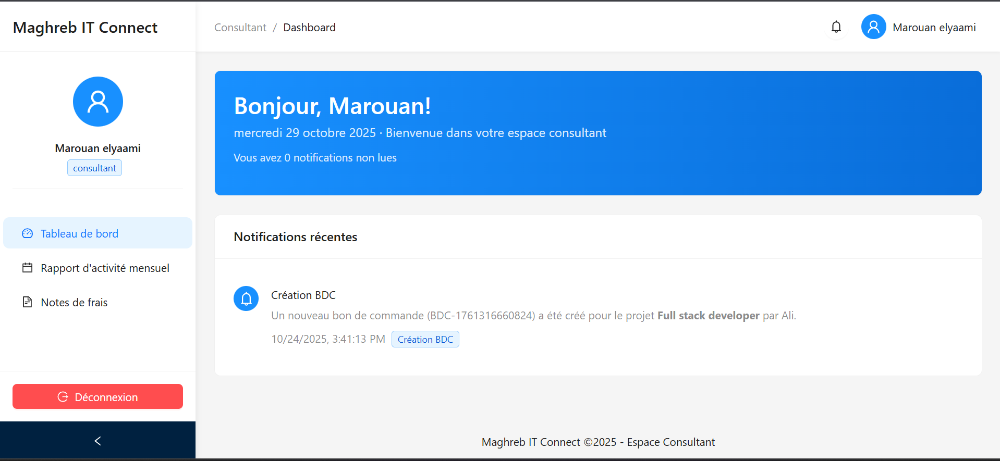
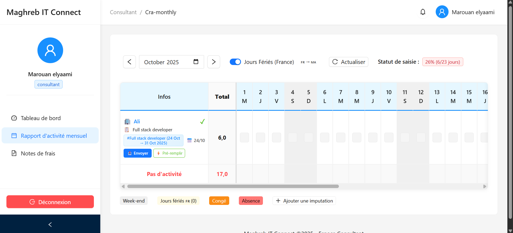
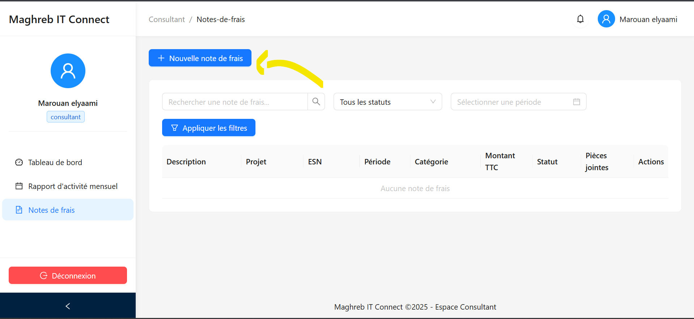
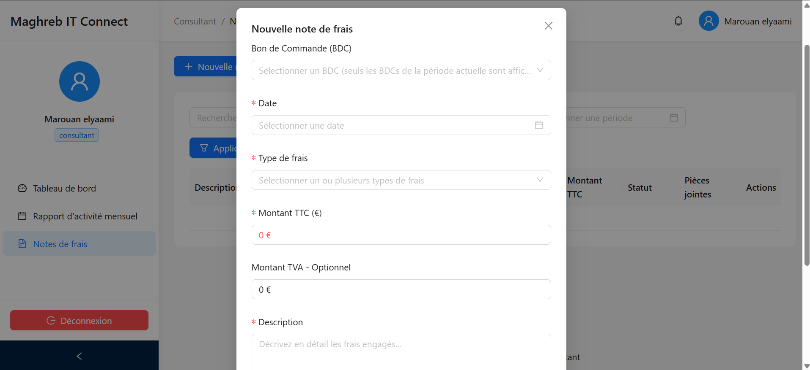
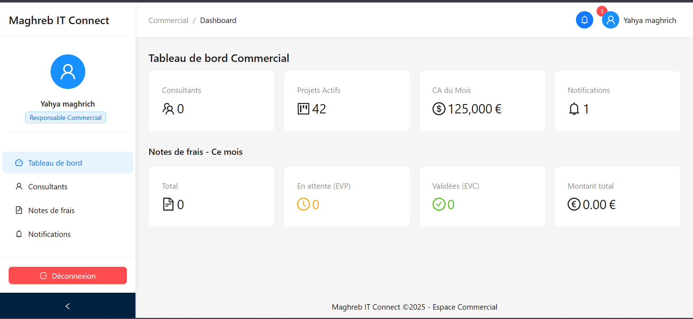
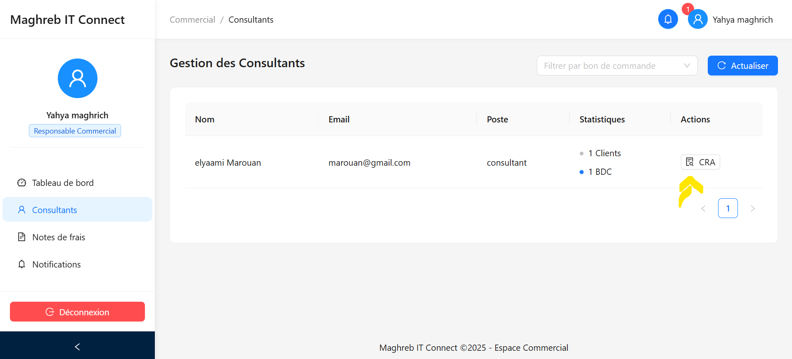
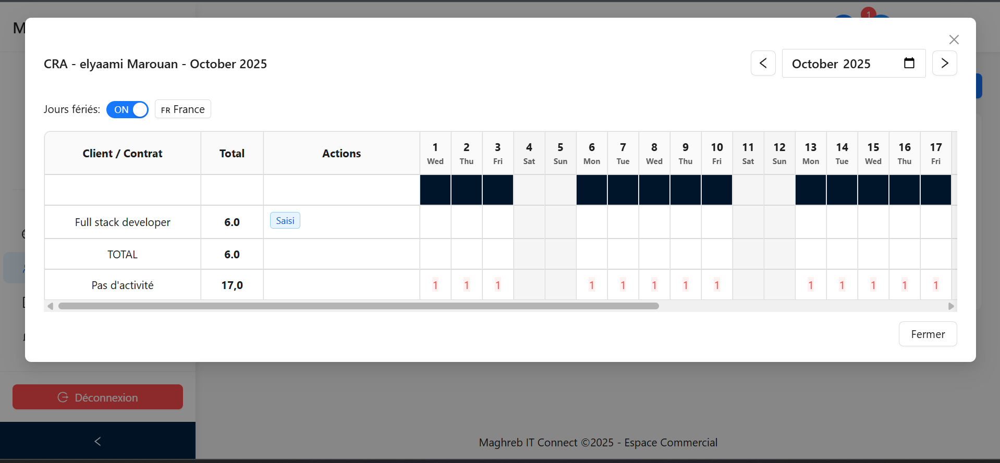
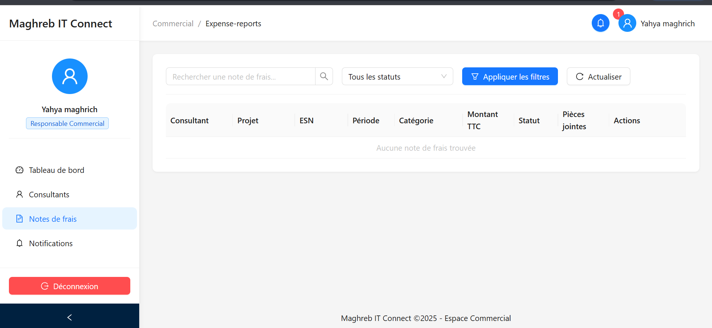

## Rôle du Consultant
En tant que consultant, vous gérez vos CRA (Comptes Rendus d'Activité), vos notes de frais, et suivez vos missions.

## Remplir Mon CRA (Compte Rendu d'Activité)

### Pourquoi remplir un CRA ?
Le CRA permet de :
- Justifier votre temps de travail

### Comment remplir un CRA ?

#### Étape 1 : Saisir les jours
Pour chaque jour de la période :
1. Cliquer sur le jour / Prérempli
2. Indiquer le **temps travaillé** :
   -  Journée complète (1 jour)
   -  Demi-journée (0,5 jour)

#### Étape 2 : Vérifier
Contrôler :
- **Total de jours** : Nombre de jours travaillés

#### Étape 4 : Soumettre
1. Cliquer sur **"Soumettre pour validation"** (Envoyer)
2. Le CRA est envoyé à votre responsable ESN
3. Puis au client pour validation finale

### Statuts du CRA
-  **Brouillon** : En cours de saisie, vous pouvez modifier
- **Soumis** : Envoyé au responsable ESN, en attente
-  **Validé ESN** : Approuvé par votre ESN, envoi au client
-  **Validé Client** : Approuvé par le client, facturation possible
-  **Refusé** : Demande de correction

### Que faire si mon CRA est refusé ?
2. Lire le **commentaire** du valideur
3. Ouvrir le CRA
4. Faire les **corrections** demandées
5. **"Re-soumettre"**

---

## Gérer Mes Notes de Frais
### Qu'est-ce qu'une Note de Frais (NDF) ?
La NDF permet de vous faire rembourser vos frais professionnels :
- Transport (train, avion, taxi)
- Hébergement (hôtel)
- Repas d'affaires
- Téléphone professionnel
- Fournitures

### Créer une Note de Frais

1. Menu **"Notes de Frais"** 
2. Remplir les informations
3. **"Joindre le justificatif"** :
   - Photo du ticket
   - Scan de la facture
   - Capture du reçu email
   - Formats acceptés : JPG, PNG, PDF

> ⚠️ **Important** : TOUJOURS joindre un justificatif !

#### Étape 3 : Soumettre
1. Vérifier toutes les lignes
2. **"Soumettre pour validation"**

Vous recevez des alertes pour :
- CRA validé

##  Rôle du Responsable (Manager)

Si vous êtes **responsable d'équipe**, vous avez des fonctions supplémentaires.
### Valider les CRA de mon équipe

1. Menu **"consultant"** → **"CRA"**

2. Liste des CRA soumis par vos consultants
3. Pour chaque CRA :
   - Contrôler les jours
   - Lire les activités
4. **"Valider"** ou **"Refuser"** avec commentaire
### Valider les NDF de mon équipe

1. Menu **Note de Frais**
2. Vérifier
3. **"Valider"** ou **"Refuser"**

