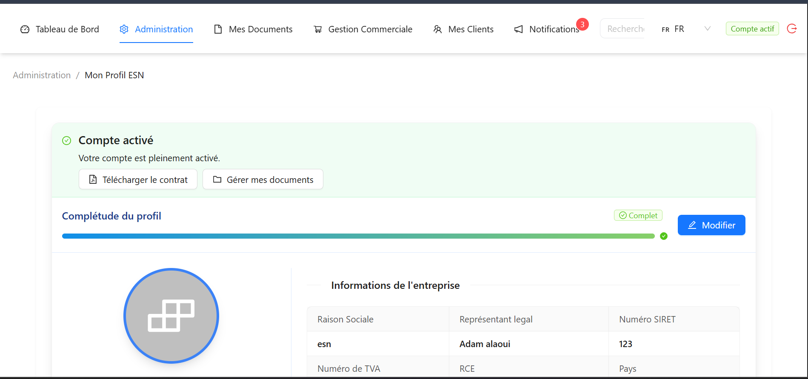
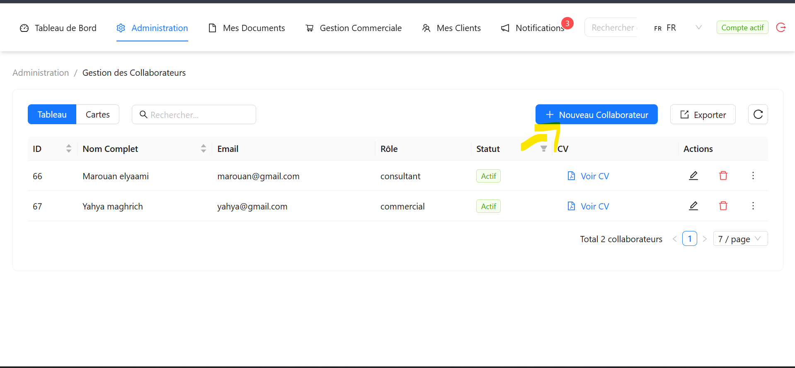
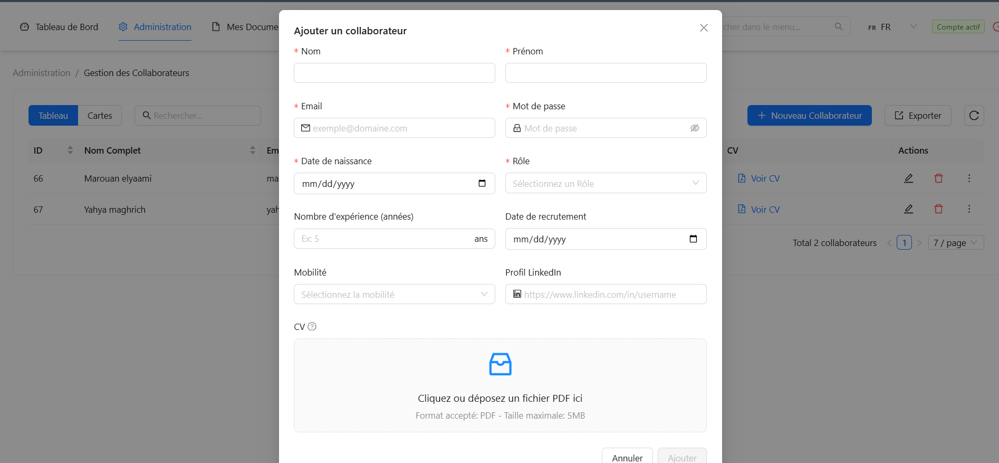
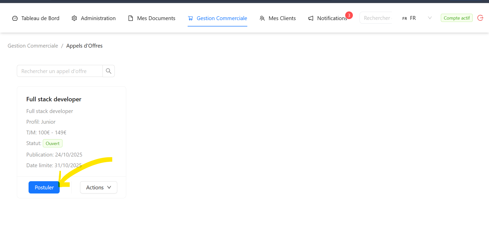
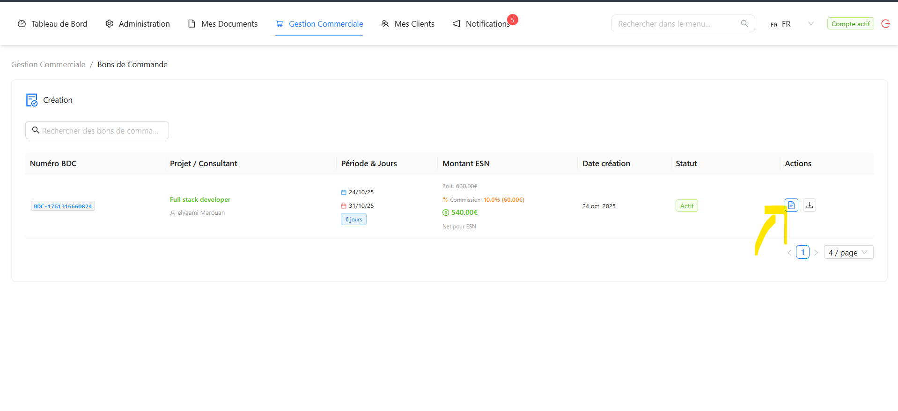
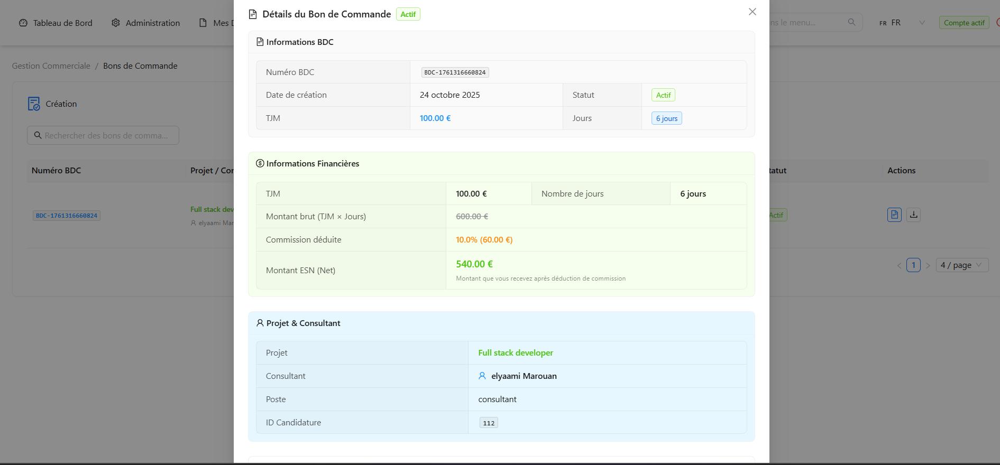
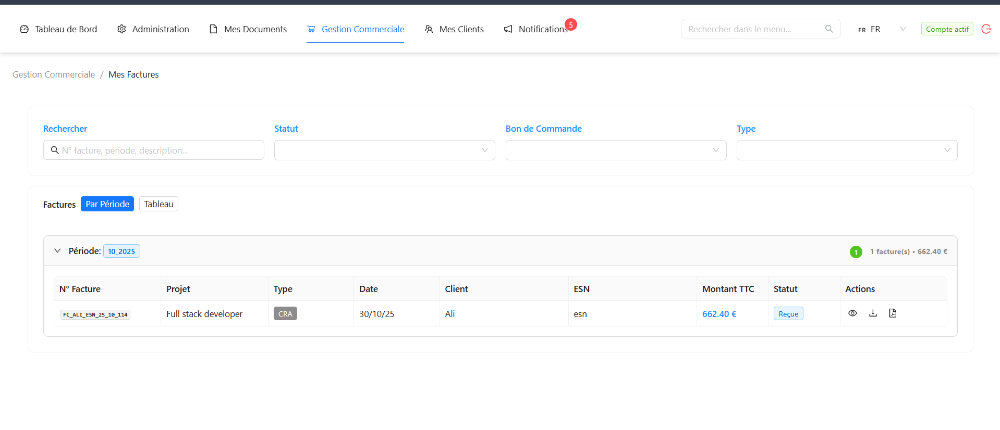

##  Rôle de l'ESN

L'ESN gère ses consultants, répond aux appels d'offres, et assure le suivi des missions.

---
##  Activer Mon Compte ESN
Menu **Administration** → **Mon Profil ESN**

### Après la création de votre compte

1. **Vérifier les informations** de votre entreprise 
2. **uploader les documents** 
3. **En attente d'acceptation par l'admin** 
   - L'administrateur vérifie vos informations
   - Délai : Généralement 1-2 jours ouvrés

4. **Signer le contrat d'utilisation** 
   - Lire les **conditions générales** (visible sur la page)
   - Cliquer sur **"Accepter et signer"**

### Votre compte est actif ! 

Vous pouvez maintenant :
- Ajouter vos consultants
- Répondre aux appels d'offres
- Gérer vos missions

---

##  Gestion des Collaborateurs
### Ajouter un nouveau Collaborateurs
Menu **Administration** → **Gestion des Collaborateurs**

1. Remplir le profil 
2. Joindre le **CV** (PDF)
3. Cliquer sur **"Enregistrer"**

##  Postuler aux Appels d'Offres
Menu **Gestion Commerciale** → **Appels d'Offres**

### Consulter les AO disponibles
1. Voir la liste des AO ouverts

### Répondre à un AO
1. Cliquer sur l'AO qui vous intéresse (Postuler)
2. Lire **détails de la mission** 
3. **"Proposer un consultant & commercail"**
4. Ajuster le **TJM**
5. **"Soumettre la proposition"**

## Gestion des Bons de Commande
Menu **Gestion Commerciale** → **Bons de Commande**
### Consulter les BDC
1. Liste de tous vos BDC 

### Valider un nouveau BDC

1. Vérifier les informations
2. Si tout est correct : **"Valider"**
3. En cas de problème : **Demander une modification**

## Gestion des Factures
Menu **Gestion Commerciale** → **Mes Factures**
### Suivre les paiements

1. Filtrer par statut/type/period
2. Accepter le reçu de paiement.

---

## Notifications

Vous recevez des notifications pour :
-  BDC à valider
-  CRA à valider
-  NDF à traiter
-  Facture payée
